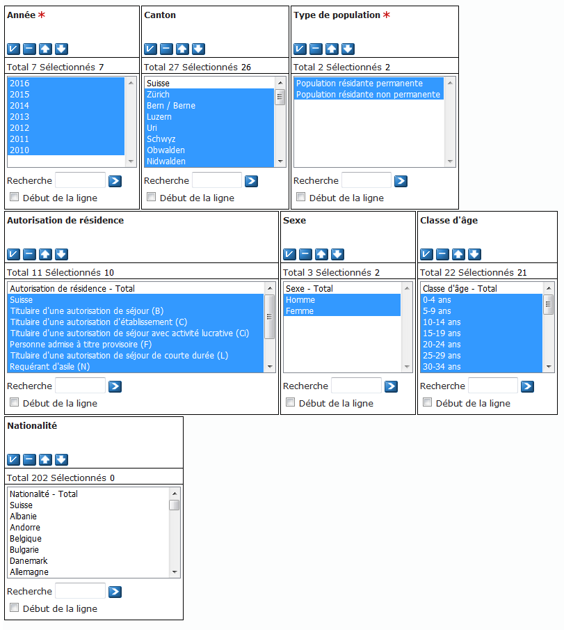
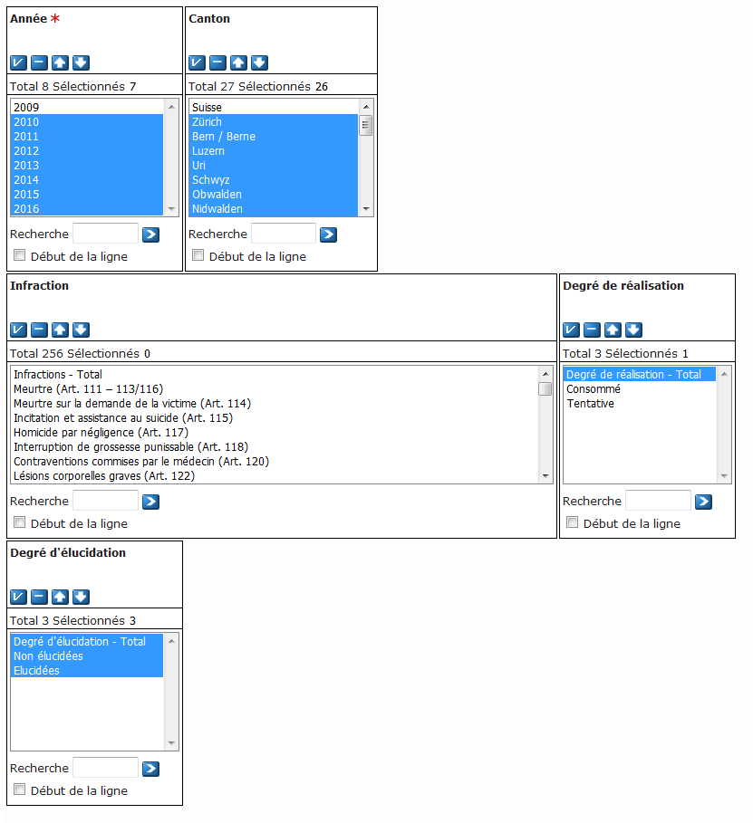

# data
!!!!!!!!  
TODO
- export les images
- explication installation
- simplification code & clean
- ajouter la possiblité de mettre des arguments pour les noms des fichiers
- 

 !!!!!!!!!
## Données brutes

Toutes les données brutes de ce projet proviennent du site [opendata.swiss](https://opendata.swiss) (le 11.01.2018). Ce site permet de choisir les données à exporter comme par exemple sur combien d'année prendre les données, vous trouverez donc ci-dessous les colonnes qui ont été choisies pour cette étude.

Les données ont été importées en français, le <b>11.01.2018</b> pour le fichier sur la population des cantons  et le  <b>18.01.2018</b> pour la criminalité. 

### Population

Les données sur la population regroupent pour chaque canton et année, le nombre d'habitants, par sexe et par autorisation de résidence (Suisse - permis B - Permis C etc.). 

#### Liens

#### Données sélectionnées

Les données ont été importées en sélectionnant les colonnes suivantes. Les données avec ont été importées avec l'option "Fichier texte (séparateur: point-virgule) avec en-tête"

| Nom                                        | Description                                                                     |
|--------------------------------------------|---------------------------------------------------------------------------------|
| Année                                      | Simplement l'année à laquelle a été enregistrer le nombre de personnes          |
| Canton                                     | Le canton de l'enregistrements du nombre d'habitants                            |
| Type de population*                        | Ce champ descrit s'il s'agit de la population permanente ou non                 |
| Autorisation de résidence                  | Définit s'il s'agit d'étranger ou de Suisse (Suisse - permis B - permis C etc.) |
| Sexe                                       | le sexe de l'echantillon de la population correspondant à la ligne              |
| Population permenante et non-permanente*   | le nombre de personne - la population                                           |

Les données sur la nationalités n'ont pas été sélectionnées car le site opendata.swiss n'autorise l'affichage/import que de 2.5 millons enregistrements, or, une fois toutes sélectionnées, les nationalités, en ajoutent près de 30 millions. 

### Ciminalité

Les données sur la criminalités, quant à elles, regroupe le nombre de crimes illucidés/non-illucidés faits par canton et par année. 

#### Liens

 #### Données sélectionnées
 
Les données ont été importées en sélectionnant les colonnes suivantes. Les données avec ont été importées avec l'option "Fichier texte (séparateur: point-virgule) avec en-tête"

| Nom                                              | Description                                                            |
|--------------------------------------------------|------------------------------------------------------------------------|
| Année                                            | L'année des données                                                    |
| Canton                                           | Le canton concerné                                                     |
| Degré de réalisation - Total Degré d'élucidation | Nombre d'infractions du canton pour l'année                            |
| Degré de réalisation - Total Non élucidées       | Nombre d'infractions élucidées                                         |
| Degré de réalisation - Total Elucidées           | Nombre d'infractions commis non élucidées                              |

## Données traitées

 Afin de générer les données dont nous avons besoins pour notre étude, nous avons utilisé deux scripts Javascript.

 

## Instruction à suivre
Pour réproduire ces données importez les deux fichier CSV depuis le site avec les colonnes  comme indiqué dans les parties `Données sélectionnées` depuis le site Opendata.swiss ou prenez-les directement depuis le dossier `/data/raw/`. Suivez 
- Ouvrez les fichiers avec un éditeur et supprimer 
- Importez le repo.
- Lancez un invite de commande et déplacer vous jusqu'au dossier `code/scripts/`
- Lancez le script sur la population (`code/scripts/populationScript.js`) puis le second (`code/scripts/criminaliteScript.js`). (Suivez les instructions d'utilisation des scripts disponibles [ici](../code/readme.md) )

