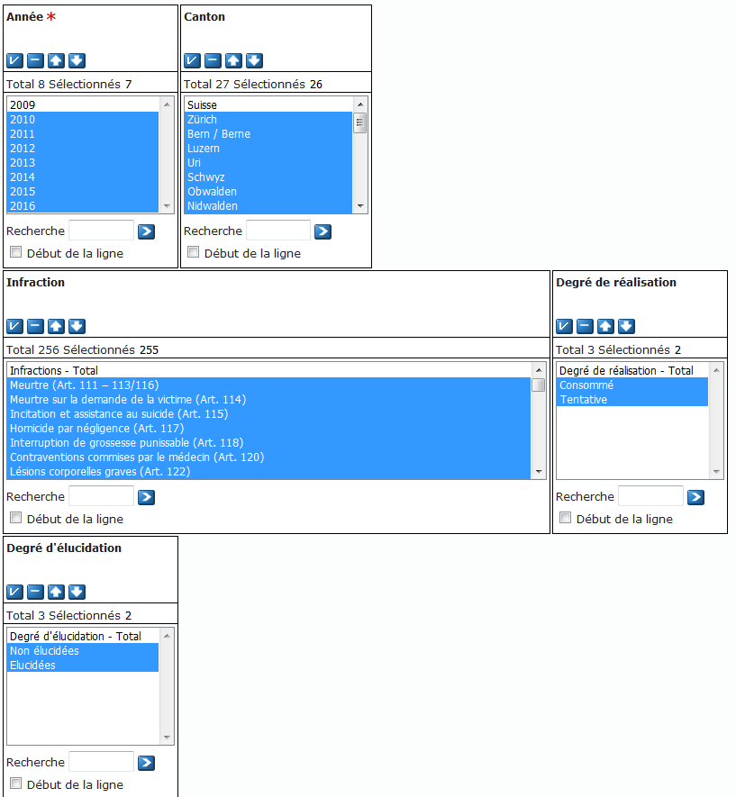

# data

## Raw data
 * [Raw data](/raw/readme.md)
 * Includes URL, description and date accessed
Toutes les données brutes de ce projet ont été prises du site [opendata.swiss](https://opendata.swiss) (le 11.01.2018). Ce site autorise notamment le choix des données à exporter (pour par exemple avoir les données uniquement d'un canton), vous trouverez donc ci-dessous les colonnes qui ont été importer pour cette étude.

Les données ont été importer français

### Population

Les données sur la population regroupe pour chaque cantons le nombre d'habitants par sexe et par autorisation de résidence (Suisse - permis B - Permis C etc.).

#### liens

#### données sélectionnées
| Nom                                        | Description                                                                     |
|--------------------------------------------|---------------------------------------------------------------------------------|
| Année                                      | Simplement l'année à laquelle a été enregistrer le nombre de personnes          |
| Canton                                     | Le canton de l'enregistrements du nombre d'habitants                            |
| Type de population*                        | Ce champ descrit s'il s'agit de la population permanente ou non                 |
| Autorisation de résidence                  | Définit s'il s'agit d'étranger ou de Suisse (Suisse - permis B - permis C etc.) |
| Sexe                                       | le sexe de l'echantillon de la population correspondant à la ligne              |
| Population permenante et non-permanente*   | la population                                                                   |

* il semblerait qu'il y ait un problème sur le site Opendata.swiss car quoi qu'on est sélectionné conernant le type de populations, il ne vous resortira tout de même Population permenante et non-permanente ensemble. 

### Ciminalité

## Processed data
 * [Processed data](processed/readme.md)
 * File should be named so it is easy to see which [script](../code/) has generated the data
 * Processed data should be [tidy](https://github.com/jtleek/datasharing)

## Study design
 * How data were collected...
 * ...

## Code book
 * Description of variables and their units
 * ...

## Instruction list
 * How to go from raw data to tidy data
