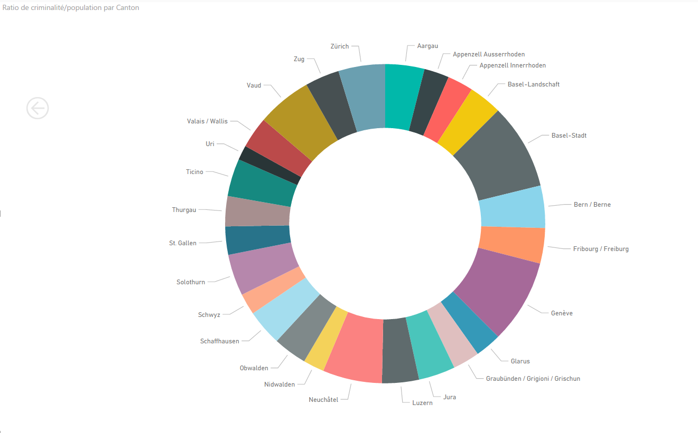

# Figures

## Graphique
Vous pouvez accéder à tous les graphiques crées avec le fichier [allGraph](./exploratory/allGraph.pbix). 

`final/2016-CriminaliteParCanton.png` est un graphique qui montre les cantons ordré par taux de criminalités il permet facilement des déterminer quels sont le cantons les plus/moins sur

`final/EvolutionCriminaliteParCanton.png` contient les mêmes informations que le graphique précédent mais avec en plus la notion d'année. Il permet de voir l'évolution du taux de criminialité par habitant assez facilement.

### Mesure utilisée
Pour calculer le taux de criminalité par habitant, un calcule a été effectuée dans Power BI. Pour le reproduire: une fois les données des CSV importées:
- créez, pour la table population, une mesure 
- copiez ceci : `votreMesure = Sum(criminaliteTable[Degré de réalisation - Total Degré d'élucidation - Total])/SUM(populationTable[Population total])*100` *
- vous pouvez maintenant l'utiliser comme valeur 

*multiplié par 100 pour avoir des nombres plus grand

## Mauvais graphique
Ce graphique contient les mêmes informations que celui-ci `final/2016-CriminaliteParCanton.png`. Ce graphique n'est pas adapté car il ne permet pas facilement de déterminer un ordre entre chaque canton.

