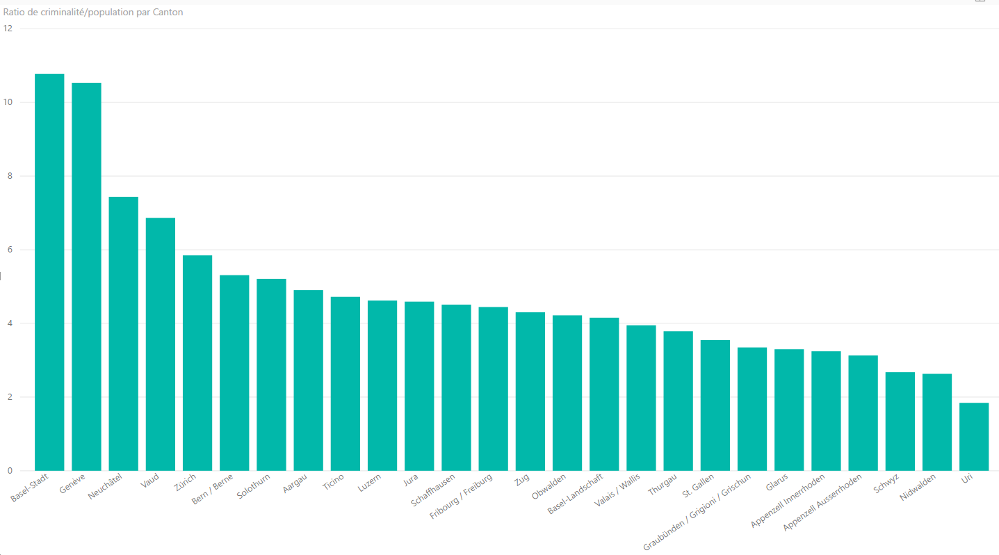
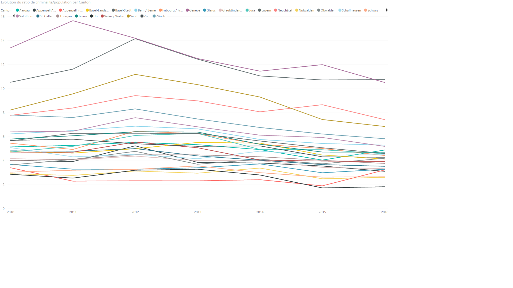

# Text

 * Readme file that includes a step-by-step instructions to run the analysis (if not present in the [data folder](../data/readme.md))
 * and the final report

## Final report
 * Should include
   * Title
   * Introduction (motivation)
   * Methods (statistics you used)
   * Results (including measures of uncertainty)
   * Conclusions (including potential problems or limitations)
 * It should tell a story
 * It should not include every analysis that had been run

# La criminalité en Suisse
# Introduction
La Suisse est un des pays avec le taux de criminalité le plus bas du monde. Au niveau de ses régions qu'en est-il ? Quel canton commet le moins d'infraction au code pénal ?  

Le but de ce dossier est de déterminer `quel canton était le plus sûr de Suisse et d'explorer les liens qu'il pourrait y avoir avec l'environnement des différents cantons et ce taux de criminalité.

## Provence des données
Les données de cette étude ont été exportées depuis le site [Opendata.swiss](https://opendata.swiss/en/):
- le <b>11.01.2018</b> pour le fichier sur la population
- le <b>18.01.2018</b> pour le fichier sur la criminalité.`

le fichier sur la population contient la population par canton et par année ainsi que d'autres données telles que l'âge moyen dans le canton.

le fichier sur la criminalite contient, quant à lui, les nombre total d'infraction par canton et année.

Les données sur la population ainsi que celle sur la criminalités ont été récoltées par Office fédéral de la statistique OFS qui est le centre de compétence de la statistique publique suisse.

# Résultats

Ce graphique montre, pour chaque canton, le taux de criminalité par habitant. Trié du taux le plus haut au plus bas, il permet facilement de déterminer une listes des cantons les plus / moins sûrs.

On peut remarquer que les deux cantons où le taux de criminalité par habitant est le plus élévé (et de loin), Gènève et Bâle-ville, sont des cantons avec de très grandes villes et peu de supérficie (km^2). D'ailleurs, ces deux cantons font partie des 2 cantons les plus denses de Suisse (et de loin également). On pourrait donc établir que la criminalité augmente selon la densité de population de l'endroit où nous nous trouvons. Dans le même sens, Uri est le deuxième canton avec la densité de population la plus basse de Suisse.

Nous avons pu déterminer `quel canton était le plus sûr de Suisse`, il s'agit de Uri. Le problème est qu'il ne s'agit que de l'année 2016. qu'en est-il des autres années. 

Voila, un graphique qui permet d'avoir une idée sur plusieurs années. ([lien vers l'image](../figures/final/EvolutionCriminaliteParCanton.png) pour faciliter la lecture.)

On peut observer que depuis 2012, il y a une baisse de criminalité dans presque tous les cantons. Nous avons pas été plus loin quant à la raison de cette baisse mais cet [article](https://www.24heures.ch/suisse/parlement-veut-durcir-code-penal/story/25814435) peut être une piste.

En ce qui concerne notre question, Uri n'a pas toujours été le canton le plus bas mais toujours en bonne position.

# Conclusion
En résumé, on peut dire que Uri est un des canton les plus sûr de Suisse. Et qu'il semblerait qu'il y est un lien entre la criminalité et la densité de la population. Il aurait été intéressant de directement comparer la densité avec le taux de criminalité afin de voir s'il existe une véritable corrélation entre les deux.

 De plus, on a également observer un baisse général de la criminalité en Suisse depuis 2012.

 Enfin, il pourrait intéressant de faire la même étude mais plutôt par type d'infraction, exemple: les cantons où il y a le moins/plus de cambriolage par habitant. 

